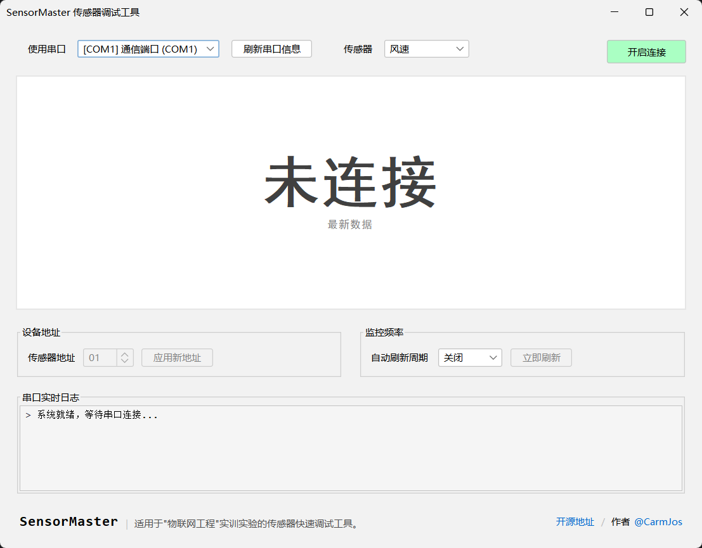
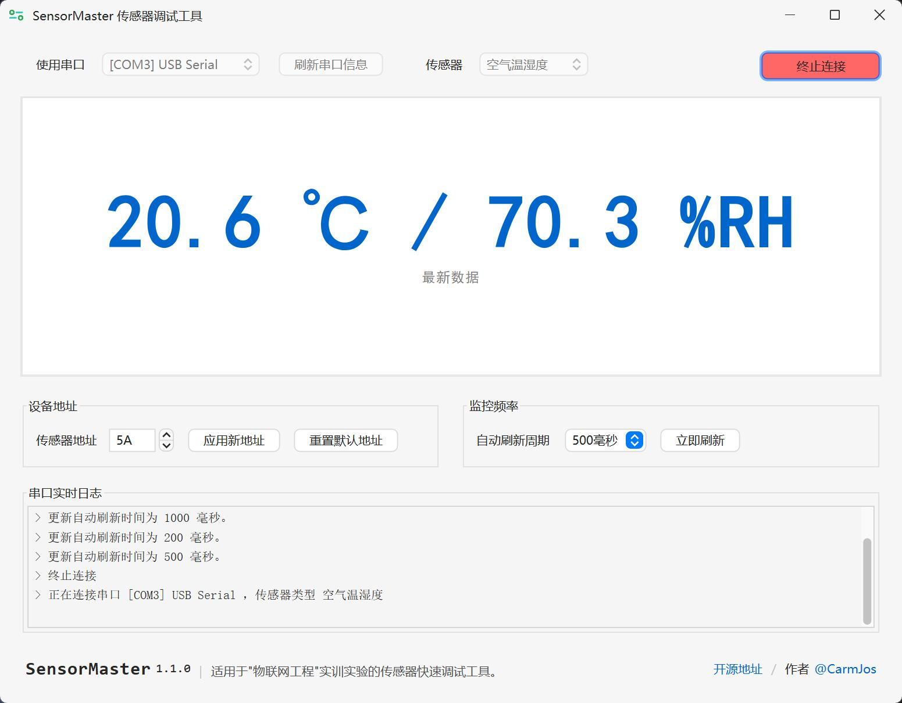

# SensorMaster

适用于“物联网工程”实训实验的传感器快速调试工具。

> [!IMPORTANT]
> 本项目的部分代码利用AI实现，个人只重点关注了项目结构与逻辑设计。
>
> 如您需要使用或修改代码，请务必仔细阅读并理解代码逻辑，确保其符合您的需求和安全要求。

如有任何问题或建议，欢迎通过邮箱 [**carm@carm.cc**](mailto:carm@carm.cc)
或 [issues](https://github.com/CarmJos/SensorMaster/issues/new) 联系我。

## 使用方法

|  |  |
|------------------------------------------------------------------|------------------------------------------------------------------|

您可以在 [Releases](https://github.com/CarmJos/SensorMaster/releases) 页面下载最新版本的可执行文件。

1. 必须使用 Java 8 及以上版本运行本项目。
    - 请确保您的系统已安装 Java 8 及以上版本运行环境。
    - 或[下载 JRE8](https://download.bell-sw.com/java/8u482+10/bellsoft-jre8u482+10-windows-amd64.zip) 解压与文件同目录下，并将JRE文件夹命名为 `runtime`。
2. 双击`可执行文件(SensorMaster-x.x.x.exe)`或在命令行中运行 `java -jar SensorMaster-x.x.x.jar` 启动软件。
3. 显示页面后，请选择串口与想要调节的传感器类型，并点击“开始连接”按钮。
4. 等待软件自动识别传感器地址并显示其数据。
5. 识别成功后，您可以在软件界面上调节传感器的地址，并查看数据变化。
6. 点击“停止连接”按钮结束调试。

## 开源许可证

本项目源代码采用 [GNU通用公共许可证 v3.0](https://opensource.org/licenses/GPL-3.0) 开源协议。

# AI工具使用说明

本项目的部分代码由AI工具生成，主要用于加速开发过程和提供代码示例。以下为本项目所使用的AI工具与用途：

- **DeepSeek**: 用于处理源数据表格，使其生成了更易于读取的 [SENSOR_MAP](.doc/SENSORS_MAP.md)。
- **Google Stitch**: 用于设计初始软件前端样式（实际并没有直接使用）。
- **Claude Code**: 协助我完成了大量重复的代码工作（如将SENSOR_MAP转换为Java代码），并实现了部分前端内容。
- **Google Gemini**: 实现了基本的前端框架内容。

## 支持

感谢 JetBrains 为我们提供免费的开发工具许可证，以便我致力于此项目及其他开源项目的开发工作。  

___

